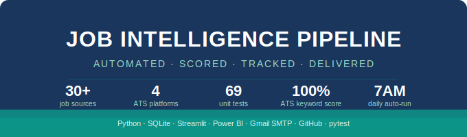
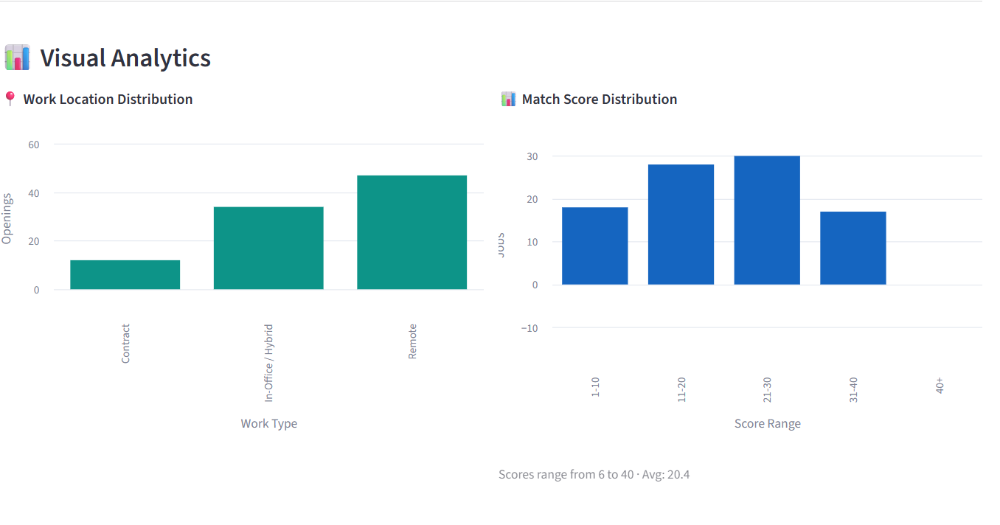
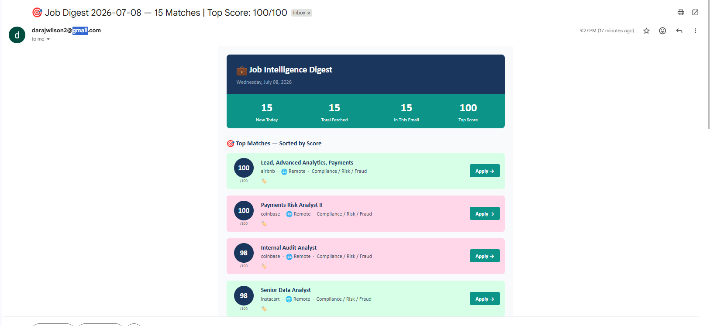
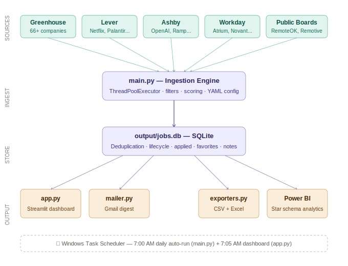

<div align="center">



<br><br>


<br>


</div>

---

<div align="center">

| 🏢 30+ | 🔌 4 | ⏰ 7 AM | 🎯 100% | 📊 500+ |
|:---:|:---:|:---:|:---:|:---:|
| Companies Monitored | ATS Platforms | Daily Auto-Run | Automatic Scoring | Jobs Processed |

</div>

---

<h2 align="center">📸 Screenshots</h2>

### Streamlit Dashboard

> *Browse, filter, and track applications with live SQLite sync*

### Daily Email Digest

> *Color-coded job cards with Apply buttons delivered every morning*

---

## 🏗 Architecture

<div align="center">

</div>

---

## ✨ Features

| Feature | Description |
|---------|-------------|
| 🔄 **Concurrent fetching** | ThreadPoolExecutor queries 30+ sources in parallel — 3 min → 30 sec |
| 🧮 **Keyword scoring** | Weighted scoring engine with combo bonuses for hybrid-skill postings |
| 🗄 **SQLite persistence** | URL-based deduplication — never see the same job twice |
| 📊 **Application tracker** | Mark applied, favorite, add notes — saves instantly to database |
| 📧 **Daily email digest** | Color-coded HTML email with top matches via Gmail SMTP/TLS |
| 📈 **Streamlit dashboard** | Live charts, sidebar filters, job cards, KPI metrics |
| 📐 **Power BI integration** | Star schema: `Fact_Jobs` ──(1:N)── `Dim_ATS_Metrics` |
| ⚙️ **Zero-code config** | `config.yaml` — change titles, companies, keywords without touching Python |
| ✅ **69 unit tests** | `pytest` coverage for filters, scoring, and location detection |
| 🔒 **GitHub-safe** | `.gitignore` excludes database, logs, `.env`, `.idea/`, `__pycache__/` |

---

## 🚀 Quickstart

### Prerequisites
- Python 3.10+
- Windows (Task Scheduler automation)
- Gmail account with 2-Step Verification enabled

### Installation

```bash
# 1. Clone the repository
git clone https://github.com/darajwilson2-web/Job-Intelligence-Pipeline.git
cd Job-Intelligence-Pipeline

# 2. Create virtual environment
python -m venv .venv
.venv\Scripts\activate

# 3. Install dependencies
pip install -r requirements.txt

# 4. Set Gmail App Password (Windows)
# Windows key → "Edit environment variables" → User variables → New
# Name: GMAIL_APP_PASSWORD   Value: your-16-char-app-password

# 5. Run your first job search
python main.py
```

---

## ⚙️ Configuration

All search preferences live in `config.yaml` — no Python knowledge needed:

```yaml
# Your location and preferences
your_city: "Charlotte, NC"
include_remote: true
include_contract: true
min_score: 3

# Target job titles
title_filters:
  - "fraud analyst"
  - "compliance analyst"
  - "risk analyst"
  - "executive assistant"
  - "data analyst"

# Companies to track (by ATS platform)
greenhouse_companies:
  - stripe
  - affirm
  - coinbase
  - gitlab

ashby_companies:
  - openai
  - ramp
  - deel
```

---

## 🖥 CLI Commands

```bash
# Full run — fetch, score, export, send email
python main.py

# Show only jobs not seen before
python main.py --new-only

# Show your top 20 unreviewed matches
python main.py --top

# Pipeline summary stats
python main.py --summary

# Mark a job as applied
python main.py --mark-applied "https://job-url-here" --notes "Applied via LinkedIn"

# List all applications submitted
python main.py --applied

# Launch the dashboard
streamlit run app.py
```

---

## 📊 Sample Output

```
============================================================
Run complete — 89 jobs exported
  New today:    23
  Total in DB:  312

By role type:
  Compliance / Risk / Fraud: 57
  EA / Business Partner: 10
  Data / Analytics: 22

By work type:
  Remote: 45
  In-Office / Hybrid: 32
  Contract: 12

Files saved:
  output/jobs_2026-07-08.csv
  output/jobs_2026-07-08.xlsx
  output/jobs.db  (full history + tracker)

📧 Sending daily email digest...
✅ Email digest sent successfully
============================================================
```

---

## 🗂 Project Structure

```
Job-Intelligence-Pipeline/
├── main.py              # Orchestrator — concurrent fetch, filter, score, export, email
├── config.yaml          # All user preferences — edit this, not the Python files
├── models.py            # Typed Job and JobRecord dataclasses
├── database.py          # SQLite persistence layer + application tracker
├── filters.py           # US location, title, and contract filtering (44 tests)
├── scoring.py           # Keyword scoring + combo bonuses + role/sector detection (25 tests)
├── exporters.py         # CSV + color-coded Excel export
├── app.py               # Streamlit dashboard with live SQLite sync
├── mailer.py            # Gmail SMTP/TLS daily digest
├── requirements.txt
├── README.md
├── .gitignore
├── ats/
│   ├── __init__.py
│   ├── common.py        # RemoteOK, Remotive, WeWorkRemotely
│   ├── greenhouse.py    # Greenhouse API (Stripe, Coinbase, GitLab...)
│   ├── lever.py         # Lever API (Netflix, Palantir, Carta...)
│   ├── ashby.py         # Ashby API (OpenAI, Ramp, Deel...)
│   └── workday.py       # Workday wd1–wd12 wildcard fetcher
├── tests/
│   ├── test_filters.py  # 44 filter tests
│   └── test_scoring.py  # 25 scoring tests
└── output/              # Generated files (excluded from Git)
    ├── jobs.db
    ├── jobs_YYYY-MM-DD.csv
    ├── jobs_YYYY-MM-DD.xlsx
    └── run.log
```

---

## 🛠 Technology Stack

| Layer | Technology |
|-------|-----------|
| Language | Python 3.12 |
| Concurrency | `ThreadPoolExecutor` |
| Database | SQLite 3 (via `sqlite3`) |
| Dashboard | Streamlit + Plotly |
| Analytics | Power BI Desktop |
| Email | `smtplib` + Gmail SMTP/TLS |
| Excel export | `openpyxl` |
| Config | PyYAML |
| HTTP | `requests` + `feedparser` |
| Testing | `pytest` (69 tests) |
| Version control | Git + GitHub |
| Automation | Windows Task Scheduler |

---

## 🔌 ATS Platform Coverage

| Platform | Companies |
|----------|-----------|
| **Greenhouse** | Stripe, Affirm, Robinhood, Coinbase, Airbnb, Instacart, GitLab, Elastic, Okta, Cloudflare, Datadog, HubSpot |
| **Lever** | Netflix, Palantir, Carta, Checkr, Samsara, Gusto |
| **Ashby** | OpenAI, Perplexity, Ramp, Brex, Deel, Anduril |
| **Workday** | Atrium Health, Novant Health, Humana, Aetna, Wells Fargo, Bank of America, Truist |
| **Public boards** | RemoteOK, Remotive, We Work Remotely |

---

## 🗓 Automation Setup (Windows Task Scheduler)

Two scheduled tasks run automatically every morning:

**Task 1 — Daily Job Intelligence Sync (7:00 AM)**
```
Program:   C:\Users\Owner\Documents\Job_Fetcher\.venv\Scripts\python.exe
Arguments: main.py
Start in:  C:\Users\Owner\Documents\Job_Fetcher
```

**Task 2 — Job Dashboard Startup (7:05 AM)**
```
Program:   C:\Users\Owner\Documents\Job_Fetcher\.venv\Scripts\streamlit.exe
Arguments: run app.py
Start in:  C:\Users\Owner\Documents\Job_Fetcher
```

---

## 🧪 Running Tests

```bash
# Run all 69 tests
python -m pytest tests/ -v

# Run filter tests only
python -m pytest tests/test_filters.py -v

# Run scoring tests only
python -m pytest tests/test_scoring.py -v
```

---

## 🔧 Engineering Challenges

Real problems encountered and solved — the kind of questions that come up in technical interviews.

**1. Different ATS API response structures**
Each platform returns data differently. Greenhouse nests location inside `{"location": {"name": "..."}}`. Lever uses `categories.location`. Ashby uses a flat `location` field. Workday requires a POST request with a JSON body, not a GET. Solution: separate fetcher files per platform — changing one never breaks the others.

**2. The "australia" matching "us" location bug**
Simple substring matching caused `"australia".contains("us")` to return `True`, flooding results with international jobs. Fix: word-boundary regex for short tokens so `"us"` only matches as a standalone word. Same fix for `", ca"` matching inside `"canada"`. 44 unit tests in `test_filters.py` now catch this class of bug automatically.

**3. SQLite schema migration without data loss**
Early runs created `jobs.db` without a `description` column. Later additions needed it. Deleting the database would erase applied/favorite/notes data. Solution: `ensure_schema()` runs on every startup, checks `PRAGMA table_info(jobs)`, and adds only missing columns — zero data loss, fully backward compatible.

**4. Concurrent fetching with graceful failure handling**
Sequential fetching across 30+ sources took 3+ minutes. `ThreadPoolExecutor` reduced this to under 30 seconds. Challenge: one failed API call shouldn't crash the entire run. Each future is wrapped in try/except inside `as_completed()` — a 403 from a private board logs a warning and continues, the rest of the results save normally.

**5. Streamlit live SQLite sync**
Streamlit re-renders the entire page on any state change. Updating a checkbox needed to detect the change, write to SQLite, then re-render with the new database value — not Streamlit's stale widget state. Solution: compare widget value against database value on each render, write to SQLite if different, then call `st.rerun()`.

**6. HTML stripping from ATS job descriptions**
Greenhouse and Lever return descriptions as raw HTML with nested tags and encoded entities (`&amp;`, `&lt;`). Solution: `clean_description()` runs `html.unescape()` first, then strips all tags with `re.sub(r"<[^>]+>", " ", text)`, then collapses whitespace — clean readable text on every job card.

---

## 🗺 Future Enhancements

- [ ] Streamlit Community Cloud deployment — public URL for portfolio sharing
- [ ] LLM-powered job summary extraction — one-sentence role summaries per posting
- [ ] Resume auto-tailor — match resume bullets against specific job descriptions
- [ ] Interview tracker — calendar integration for scheduled screens and follow-ups
- [ ] Salary range detection — extract compensation data from job descriptions

---

<div align="center">

---

</div>

<div align="center">

## 👩‍💻 About

**Dara J. Wilson** — Compliance, Risk & Fraud Analytics | Data Analytics | Executive Operations

📧 Darajwilson2@gmail.com &nbsp;·&nbsp; 💼 [linkedin.com/in/darajwilson](https://linkedin.com/in/darajwilson) &nbsp;·&nbsp; 📍 Charlotte, NC | Open to Remote

<br>

*Built with Python, curiosity, and zero tolerance for manual job searching.*

</div>
